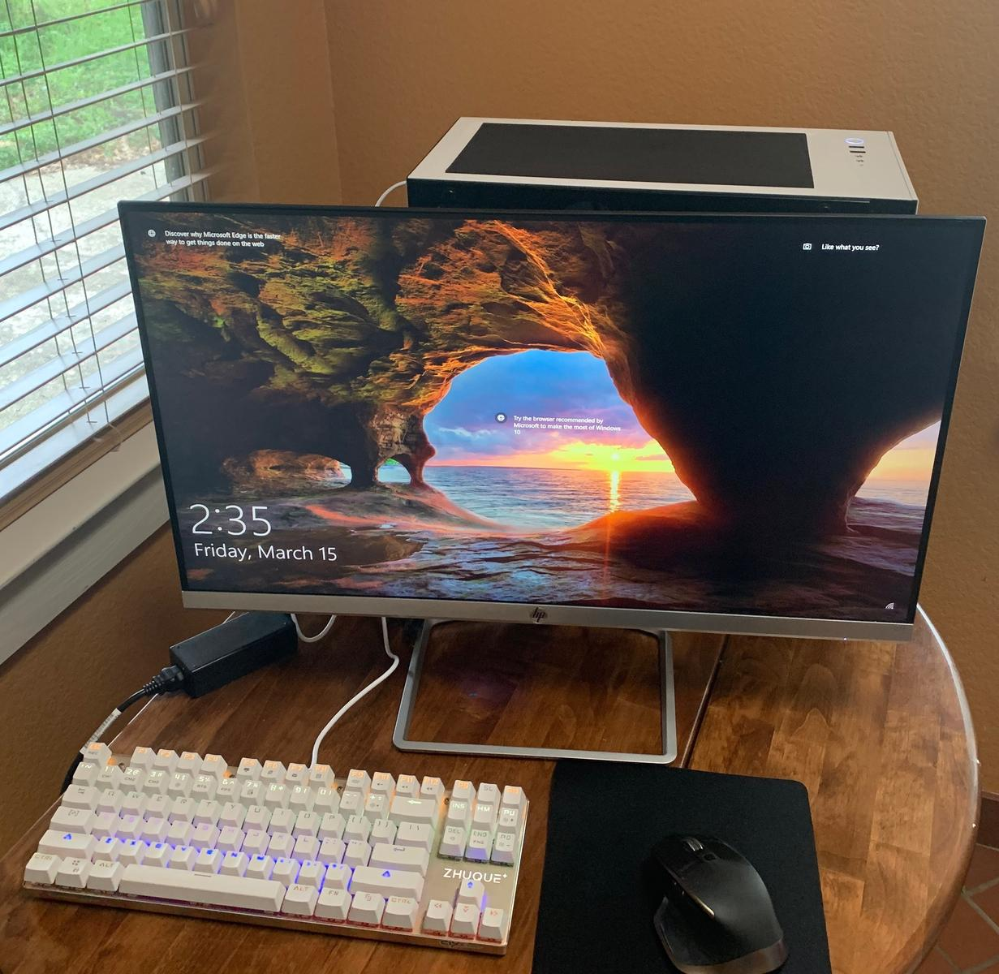
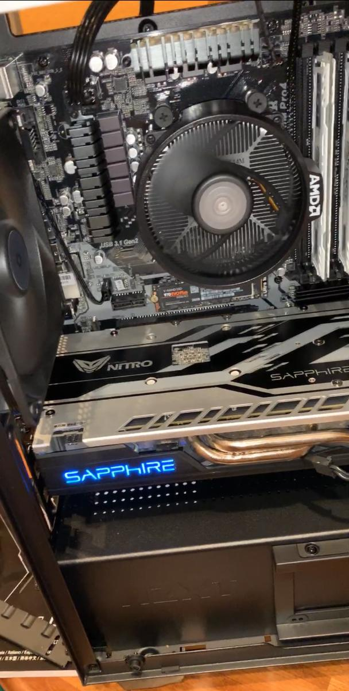

From [PCPartPicker](https://pcpartpicker.com/b/Wv7WGX):

I've built PCs in the past for others, but none for myself and have finally reached the point where I could build one I knew I'd be satisfied with especially with the recent sales going on. The overall experience was as I expected with one glaring difference being the graphics card I selected. The reason the price is so low is I bought a used crypto-mining card off of eBay, which requires flashing the BIOS to one that uses the card to its normal capability. This also worked and was easier than I expected, but of course when flashing any product there were some nerves during that reboot. Fortunately all went well and I now have a machine that will easily handle the games I play, which typically doesn't include the latest and greatest, but since the Ryzen processor included The Divison 2 for free I'm going to check it out as soon as I receive the product key.

The CPU and GPU temps appear to be handling well with the stock Wraith Spire cooler and 3 included 120mm fans with the H400, and I'll be posting a specific review to that case shortly since I was very satisfied with it. Since I don't have much else to compare to as far as performance due to only using integrated graphics before of course I'm happy with the performance with the games I've tried thus far. The "under load" temps I included are from playing Grand Theft Auto 5 and I think is a fair benchmark to use without using unnecessary stress on my hardware, but I'm open to safe recommendations.

The display in the photo is the HP 27f, but there isn't a listing for it on pcpartpicker. It is allegedly 75Hz, but runs at 60 from what I can see, 27" IPS. Similar story for the Zhuque keyboard, but more understandable since I bought in a group buy on Massdrop. More info can be found here: https://www.massdrop.com/buy/team-wolf-tkl-swappable-switch-mechanical-keyboard
