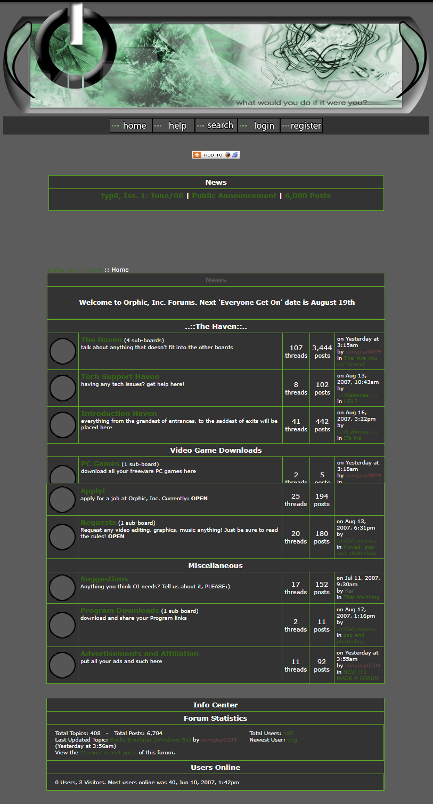

## UPDATE
## [DONE](https://korin.green)

Ehh... Start over?

Where most sites might include an "Introductory" post [by this point](https://gitlab.whatco.de/root/kyle-o-io/-/wikis/Blog-Posts), I think the true meaning behind this one will only become more clear organically. 

[In as such was proven](https://kyleo.io/dreaming-in-code-lucid-dreaming/#fnref7), software time has [claimed yet another milestone](https://gitlab.whatco.de/root/what-code-public/-/milestones/1). For me, this would be an autonomous form of the existing back-end for [What Code](https://whatco.de), and [save for upstream issues](https://gitlab.whatco.de/root/what-code-public/-/issues/2) it was near complete. With enough rigor it's possible to work around this, but would also be reverted if GitLab does at some point resolve it on their own.

// something else, split these concepts up
The purpose of this article is to retroactively collect my thoughts on trying to autonomously instantiate Docker containers through Google Kubernetes Engine ([as well as my host](https://techcrunch.com/2022/04/14/why-akamai-bought-linode/) [Linode's LKE](https://www.linode.com/content/linode-kubernetes-engine-easily-deploy-kubernetes-with-lke/)) with an explanation of why and what that means. I'll also prepare any possible future iterations in conceptual form, and share some of my own opinions on these solutions for deployment. 

I'd be remiss to neglect mentioning that I had prior misgivings with Docker and these misgivings only surface themselves further when attempting a full-scale application reliant on it as a foundation. 

While in the pursuit of optimization with a optimistic attitude, developers often find themselves in a task they're unable to pursue: the scope outweighs the technical debt of the project. During self-projects we're able to fall on re-scopes, but when demand outweighs the means a re-engagement in approach is necessary. It's at this point where I found myself with What Code when a beacon of light appeared in the form of [Cloudron.io](https://cloudron.io). Henceforth, I found and was reminded of many projects in a similar vein [read: [Nacelle](https://techcrunch.com/2020/06/29/nacelle-raises-4-8m-for-its-headless-e-commerce-platform/), [yunohost](https://yunohost.org/#/)]. While some workarounds are available for the issue I ran into, the overall execution is one that I find unsustainable. This is a re-occurring theme when each time I revisit attempting this project, it's only after a long enough break that I even realize the stop-gap solutions I'll have on hand are cohesively dead on arrival.

## December 3 2006

As with my previous entry, history is required to understand the ultimate goal which will be revealed in time. December 3, 2006 marked the launch of "Orphic, Inc.". This was a forum that I'd intended to be a business as the name suggests, albeit much would prove difficult to a teenage entrepreneur. I launched Orphic, Inc. on [ProBoards](https://proboards.com) after having spent a month doing a soft-launch with friends. To complete the journey, you [might remember my mentioning learning about graphic design and the like through communities](https://kyleo.io/dreaming-in-code-lucid-dreaming#Teenage-Debugging), but my story also begins with another one which I wrote at an even younger age. The original concept behind my business was to self-publish a work of fiction I had written for some years prior, having already spent some time trying to teach myself to design a book cover and build a website for it. It seems more novel in hindsight, but the results always astound me whenever I take a moment to step back and breathe. 

It does warrant a second warning for the image host Photobucket's mass deactivation of accounts as I wouldn't know the account's username or email associated with it:

12-30-2006

08-20-2007

08-26-2007

09-07-2007

This is when a huge slip-up occurred (ugh?), unappeased with the slow-crawl growth I had seen, I decided to commission one of the newly found graphics forums I'd been attempting to hone my craft on (I vaguely recall thinking the aesthetic would bring more people, but I really attribute this to my commitment to process). I was so excited by their forum when I found it, if I had a similarly appearance it'd work my forum as well, right?

## 12,308

Using methods [I'd experienced as effective myself](https://youtu.be/IqQzvfn_s30?t=109), I shared several forms of "viral marketing" as I'd likely consider it at the time. On December 03, 2008 (or 12.3.08) I launched The Uber Googlers using [phpBB](https://phpbb.com), thoughts about a book were a far-gone idea after I had discovered an affinity for code in between.

October 24, 2008

November 23, 2008

Don't forget you started trying this out by deploying GitLab with Rancher and that was just as fucked.

I'm really combating the premise of this title by destroying everything practically more-or-less every week for.. oh 3 months or so now?

A year ago I laughed at GitLab, needing to have a whole custom instance to get a custom domain level version of it going

3 years ago it was similar with SSLs and getting the Apache Virtual Hosts setup

Similar story 2 years ago, except with NGINX/wildcard SSLs/databases for things like WordPress. 

Last night, while amidst [this project (private link!)](BigCommerce-Developer-Advocate-app) I discovered https://whatco.de to be on an incorrect version and to make a long story short caused a kerfuffle of mass proportions that ruined the instance effectively. I need to come back to this but essentially the steps up to this point made it much easier, a somewhat abstract goal behind wanting to spin up GitLab so there is some effectiveness after all is said and done. I was able to quickly load in a Ghost CMS container on the latest version (the reason I tried modifying ghost folder permissions to begin with) and port over the loaded storage drive.

I'm essentially trying to open this access like Netlify has but packaged with GitLab. This creates an end-to-end DevOps experience [as they describe](https://about.gitlab.com/concurrent-devops/).

While it feels unfortunate to say, this new pattern has emerged of _mostly_ finishing what I want/need and I’m actually okay with it. That being a part of the pattern specifically makes it unsurprising as it’s part of the learning process. In the same way I expected to be able to go from creating a form with JavaScript at 12 to a fully functional platform, I’ll always quickly re-learn the steps in between. 
## "There's gotta be a better way" approach vs ["How hard could it be"](https://www.youtube.com/watch?v=FKTxC9pl-WM) approach

## Include wear sunscreen quotes?
https://www.chicagotribune.com/columns/chi-schmich-sunscreen-column-column.html
was thinking primarily bubblegum algebra

### Conclusion

Know your limits but that of your hardware can be a good measure for what is truly necessary. In turn, you're able to gauge what actually matters especially when looking from a larger pool of perspective. I don't expect an app idea to come out of the end of this post, but reaching towards app ideas should be a clear indication of whether I missed my mark. If it comes across that my findings are recommendations, I'm not intending to imply an understanding of Linux is necessary to program (or anything else at all from this or my prior post), my path is one still fairly wild and without many passers-by. A combination of these anecdotes and events of discovery (and self-discovery) allowed me to become a better programmer with enough perseverance and a proper strategy.

Programming isn't about app ideas, it's whether or not your code could be used for something bigger than ideas.

The purpose of WhatCo.DE is fairly difficult to define and is part of the namesake. This is meant to create a sustainable system using Open Source software or platforms which will further propagate it's viability (with the goal of making it stable and _easy_) as a system through which anyone can spin up a site with virtually unlimited bandwidth and begin their own developer journey.

For example, I hope wuu.bi to inspire others to create their own mastodon instances, same for tube.wuu.bi and PeerTube. I've had an eye on these platforms for years and I was overjoyed at how successful they've been the closer I looked.

[You should really edit this before including with public blog](https://gitlab.whatco.de/root/kyle-o-io/-/wikis/The-Religious-Experience-of-Philip-K.-Dick)

What the idea comes down to is enabling that first degree of a touchstone, while in no way can I enable a former self, I look forward to a future where such a reality could be launched with the touch of a button. It's unrealistic to attempt any possible futures that would've brought me, but I do imagine a time where a user's first interaction with the web is one of their own making. 

This might start as an application by their own hand and code, albeit completely rail-roaded. What excites me the most about a concept like this is that it would evolve beyond software by the varied nature of this course and enter a realm I thought impossible: technology that grows.

## Colophon - REMOVE

## I like Sound.

> You’re so sound is a phrase that hinges on the word sound as an adjective, not the “noisy” noun. Sound, meaning “free from special defect or injury,” has been recorded as far back as the 1200s.
> 
> Many additional meanings were born over the next few centuries. In the 1500s, sound referred to someone “healthy,” especially with respect to venereal diseases. In the 1600s, sound became something “financially safe” as well as “excellent,” “admirable,” or “dependable.”
> 
> By the mid-1800s, sound was further attributed to people considered “trustworthy” or “of sober judgment.”
> 
> In the 20th century in the United Kingdom and Ireland, sound spread as a slang term for someone you like or something that you enjoy, similar to “cool” or “awesome,” hence an expression like you’re so sound.

[Source](https://www.dictionary.com/e/slang/youre-so-sound/)

[Masterclass in Presentation/Persuation, Macworld 2007](https://youtu.be/VQKMoT-6XSg) -- [Something about how the back looks better than their front](https://youtu.be/0BHPtoTctDY?t=350)

Up in the air... floats like the wind? Is there something like WiFi/network that could be “latched onto”?