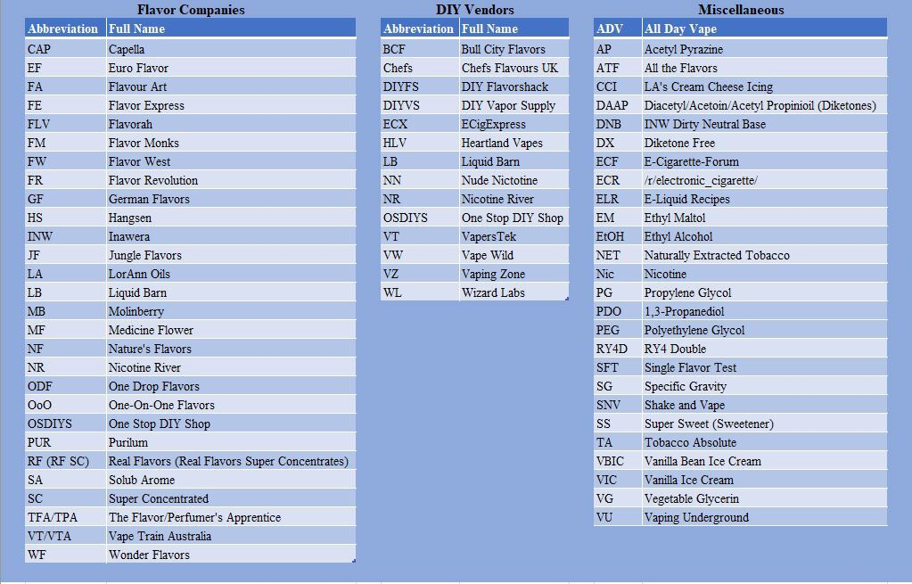

# eJuice Supplies & Tips

https://www.18650batterystore.com/20700-p/sanyo-ncr2070c.htm

https://www.advancedvapesupply.com/
coils

https://vimeo.com/365956371
[/r/DIY_eJuice FAQ](https://www.reddit.com/r/DIY_eJuice/comments/dt0jtg/the_faq_beginners_guide_resources_tutorials/?sort=new)
[/r/DIY_eJuice First Order Flavors](https://www.reddit.com/r/DIY_eJuice/wiki/first_order_flavors)

## Supplies

| Size | Description                        | Price  |
|------|------------------------------------|--------|
|      | Scale Kit for DIY eLiquid - LB 501 | $ 34.99|
| Small| Nitrile Gloves - 100 Count         | $ 7.99 |
| 1L   | USP Vegetable Glycerin             | $ 9.99 |
| 1L   | USP Propylene Glycol               | $ 9.99 |
| 500ml | Vegetable Glycerin DIY PurNic™ Nicotine 100mg | $ 27.99|
| 4oz  | Capella Sweet Guava                | $ 12.49|
| 4oz  | Inawera Shisha Strawberry          | $ 23.49|
| 4oz  | Inawera Pitaya                     | $ 17.49|
| 2oz  | Inawera Cactus                     | $ 9.29 |
| 4oz  | Flavor Apprentice Pineapple Juicy  | $ 6.99 |
| 4oz  | Flavor West Blood Orange Natural   | $ 7.50 |
| 15ml | Capella Golden Pineapple           |  $ 1.99|
| 15ml | Capella Super Sweet                |  $ 1.99|
| 15ml | Capella Vanilla Custard V1         |  $ 1.99|
| 15ml | FlavourArt Burley                  |  $ 4.15|
| 15ml | FlavourArt Fuji Apple              |  $ 3.40|
| 15ml | FlavourArt Mandarin                | $ 3.40 |
| 15ml | FlavourArt Pear                    |  $ 3.40|
| 15ml | FlavourArt Royal Orange            | $ 3.40 |
| 15ml | Flavor Apprentice Dragon Fruit     | $ 1.19 |
| 15ml | Flavor Apprentice Honeysuckle (PG) |  $ 1.59|
| 15ml | Flavor Apprentice Vanilla Custard  | $ 1.59 |
| 15ml | Flavor West Sweetener Liquid       | $ 1.09 |
| 15ml | Flavorah Lemonade                  |  $ 7.49|
| 15ml | Flavorah Milk & Honey              |  $ 5.49|
| 15ml | Flavorah Pink Guava × 1            |  $ 7.49|
| 15ml | Inawera Custard                    |  $ 2.49|
| 15ml | Inawera Pear                       |  $ 2.49|
| 15ml | Inawera Pineapple                  |  $ 2.49|
| 15ml | Inawera Raspberry                  |  $ 2.49|
| 15ml | Inawera Shisha Vanilla             |  $ 3.49|
| 15ml | Inawera Tobacco DNB                |  $ 3.49|
| 15ml | Inawera Tobacco Gold Ducat         |  $ 2.49|
| 10ml | Cinnamon Danish Swirl-Cap | $ 1.75 |
| 10ml | Honeydew Melon-Cap | $ 1.75 |
| 10ml | Sweet Strawberry-Cap | $ 1.75 |
| 10ml | Vanilla Swirl-TFA | $ 1.29 |
| 10ml | Sugar Cookie-Cap | $ 1.75 |
| 10ml | Sweetener-TFA | $ 1.29 |
| 10ml | Bavarian Cream-TFA | $ 1.29 |
| 10ml | Marshmallow-TFA | $ 1.29 |
| 10ml | Almond-FA | $ 2.25 |
| 10ml | Apple Pie-FA | $ 2.25 |
| 10ml | Fresh Cream-FA | $ 2.25 |
| 10ml | Forest Fruit-FA | $ 2.25 |
| 10ml | Marzipan-FA | $ 2.25 |
| 10ml | Lemonade-LA | $ 2.25 |
| 10ml | Sweet Fig-FLV | $ 7.49 |
| 10ml | Vanilla Ice Cream -LB | $ 2.49 |
| 10ml | Crepe-SC-WF | $ 1.99 |
| 10ml | Lemonade-FLV | $ 5.20 |
| 10ml | Apple Filling-FLV | $ 5.90 |
| 10ml | Fizzy Sherbet-VT | $ 2.99 |
| 10ml | Rice Base-VT | $ 2.99 |
| 10ml | Sugarloaf Pineapple-VT | $ 2.99 |
| 10ml | Banana Custard-VT | $ 2.99 |
| 10ml | Yes We Cheesecake-INW | $ 2.49 |

## Flavor Recommendations

Pineapple: Capella (Cap) Golden Pineapple, Inawera (INW) Pineapple, VT  Sugarloaf Pineapple

Guava: Cap Sweet Guava or Flavorah (FLV) Pink Guava

Dragonfruit: The Flavor's Apprentice (TPA) Dragonfruit ( which isn't really dragonfruit it's more a blender ) or Inawera Pitaya.

Flavor West (FW) Blood Orange is good

[https://dropperbottles.com/](https://dropperbottles.com/)
[https://www.liquidbottles.com/](https://dropperbottles.com/)

#### Sweetener
Cap Super Sweet is 10-20% Sucralose, Citric acid and some other preservatives in PG and water. FW Sweetener is just 10% sucralose in PG, TPA Sweetener is 5% maltol and 5% sucralose in PG and water, TPA super sweet is almost the same as cap but only 15% Sucralose.

### Favorite Mixes

[Prickly Victory Original](https://e-liquid-recipes.com/recipe/2961528/Prickly%20Victory%20%28Guava%20Cactus%29)
[Prickly Victory KO Remix](https://e-liquid-recipes.com/recipe/3617895/Prickly%20Victory%20Sample)

#### Possible Mixes

https://alltheflavors.com/recipes/17882#backwoods_lemonade_by_ediblemalfunction
https://alltheflavors.com/recipes/144595#bill_d_lemonade_by_kindground
https://alltheflavors.com/recipes/121307#007_cola_by_alfredpudding

###### Mother's Milk (Cuttwood/Suicide Bunny)

JF Sweet Strawberry + INW Shisha Strawberry + FA Red Touch for the strawberry, and for the cream I'd do LB Vanilla Ice Cream + TPA Bavarian Cream  + INW Shisha Vanilla

Cap Sweet Strawberry + LB VIC

##### Jazzy Boba

FA Jasmine + Rice (for mouth feel) + OOO Taro

##### Green Bastard

https://alltheflavors.com/recipes/153649#green_bastard_by_yippyo

##### Guanamelon

https://e-liquid-recipes.com/recipe/3617972/Guanamelon

### Holy Trinities

##### Blackberry Trinity from [/u/EdibleMalfunction](https://www.reddit.com/u/EdibleMalfunction)  and [/u/AlfredPudding](https://www.reddit.com/u/AlfredPudding) 

0.5% TFA Blackberry

1.5% RF SC Blackberry

0.35% FLV Boysenberry

Lots of these came from [this thread](https://www.reddit.com/r/DIY_eJuice/comments/b5cf3k/diy_digest_vii_the_blessed_trinities/).

##### Cheesecake Trinity by AlfredPudding

3% INW Yes We Cheesecake
2% CAP NY Cheesecake
1% TFA Cheesecake (Graham Crust)

##### The Ice Cream Trinity
Co.	Flavor	%
LB	Vanilla Ice Cream	5%
TFA	Vanilla Swirl	1.5%
HS	French Vanilla Ice Cream	.75%

##### Strawberry Trinity

2.50% CAP Sweet Strawberry
1.50% TFA Strawberry (Ripe)
1.50% TFA Strawberry

##### The Blueberry Trinity
Co.	Flavor	%
TFA	Blueberry Extra	3%
FW	Blueberry	2%
FA	Bilberry	0.5%

##### The Mango Trinity
Co.	Flavor	%
FLV	Mango	1%
WF	Island Mango	2%
VT	Sisha Mango	3%

##### The Strawberry Trinity
Co.	Flavor	%
INW	Shisha Strawberry	3%
FA	Red Touch	2%
JF	Sweet Strawberry	1.5%

##### SlashaLO's The Red Apple Trinity

Co.	Flavor	%
FLV	Apple	.8%
FLV	Red Apple	.8%
WF	Thai Apple	1.5%
​

I came here to toot my own horn, because that's what mixing with diesel does to your body over time. Came across this trinity several months ago, and since then, if I wanted a well round red apple, this is what I mix. There is a hint of texture, like biting into the apple. You can taste the skin of the apple, but its not overwhelming. Its a nice sweet base, especially thanks to Thai Apple. The thai apple also fills out the FLV apple mixes here. They are very tasty, but seem to miss a deeper note that thai apple fits perfectly. This is the ratio I use for the most part. I'll make a stone/base/one shot, whatever you want to call it, and mix that % into the final mix depending on the strength I want the flavor to be.

##### Stashes

[DYY Flavor Stash](https://e-liquid-recipes.com/publicstash/212165)

[KO Flavor Stash](https://e-liquid-recipes.com/publicstash/220103)